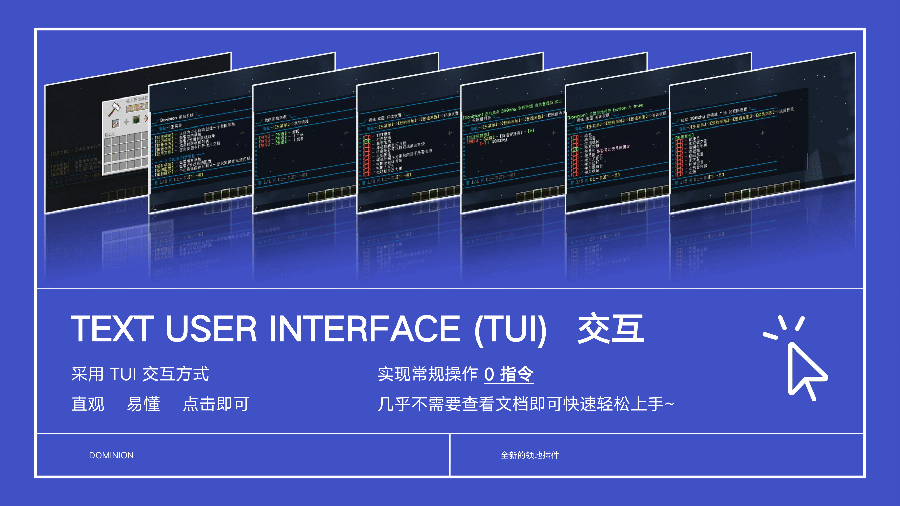
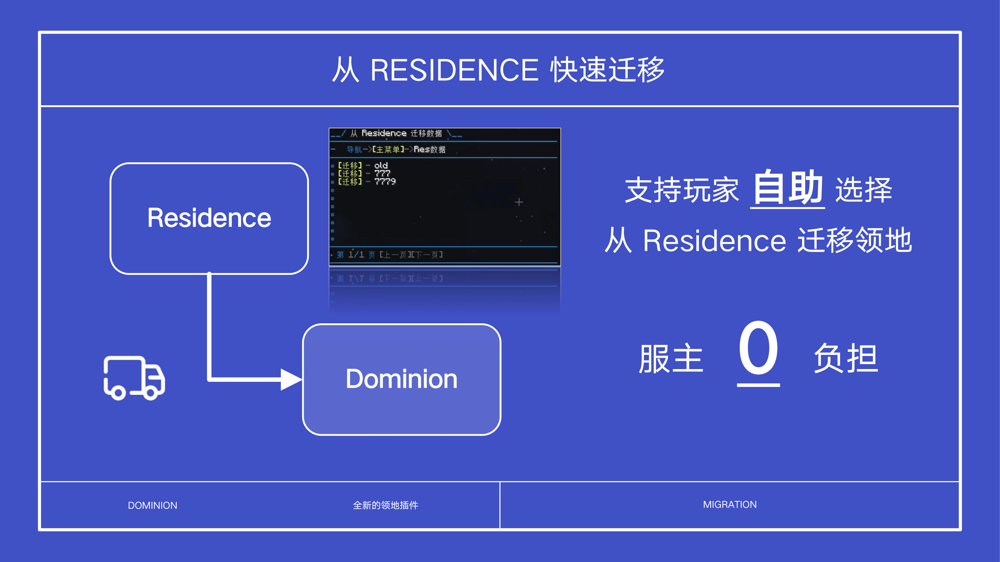
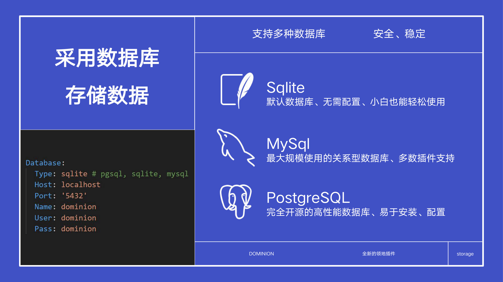
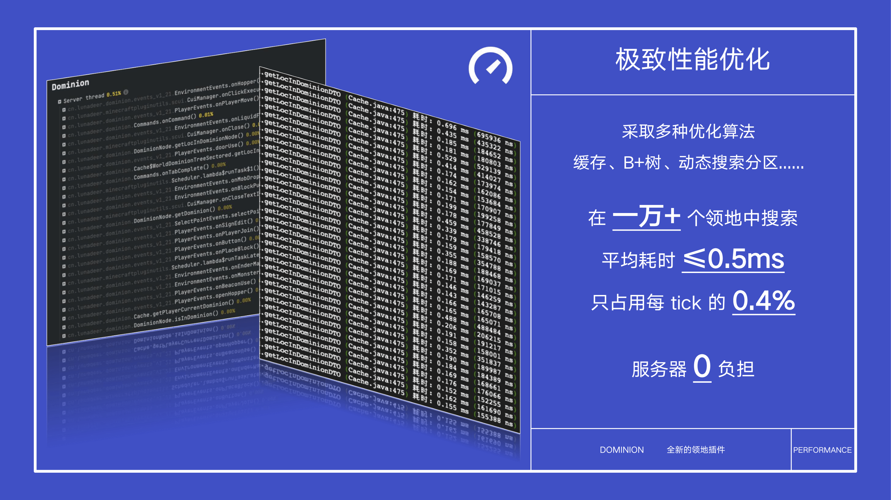

---

## 简介

鉴于 Residence 插件的作者项目较多，维护压力大，无法及时跟进新版本以及适配Folia核心。故开发此插件，旨在平替纯净版生存服Residence的使用（支持从
Res 迁移数据）。

**请注意，本插件目前处于中期测试稳定阶段，绝大多数bug或漏洞已被修复，目前已具备完全可用性。但不排除仍然存在某些问题，如果遇到任何BUG 欢迎及时在仓库提交 ISSUE 或添加QQ群告知，感激不尽。**

## 功能介绍

## 支持版本

- 1.20.1+ (Bukkit、Spigot、Paper、Folia)

> 需要使用 Java21 运行你的服务端，如果你还在使用 Java17 可以放心替换为 Java21，理论上 1.20.1+ 版本的服务端核心可以直接升级到
> Java21 启动。

## 建议与反馈

请优先在 [GitHub ISSUE](https://github.com/ColdeZhang/Dominion/issues) 提交您的问题

QQ群：309428300

## 统计

